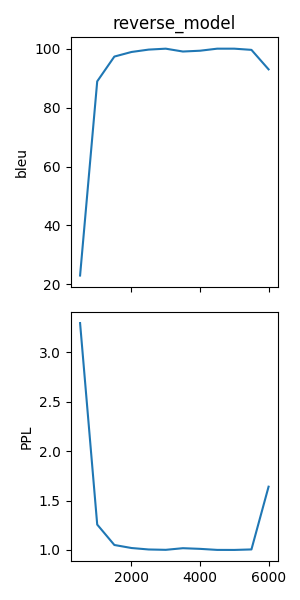
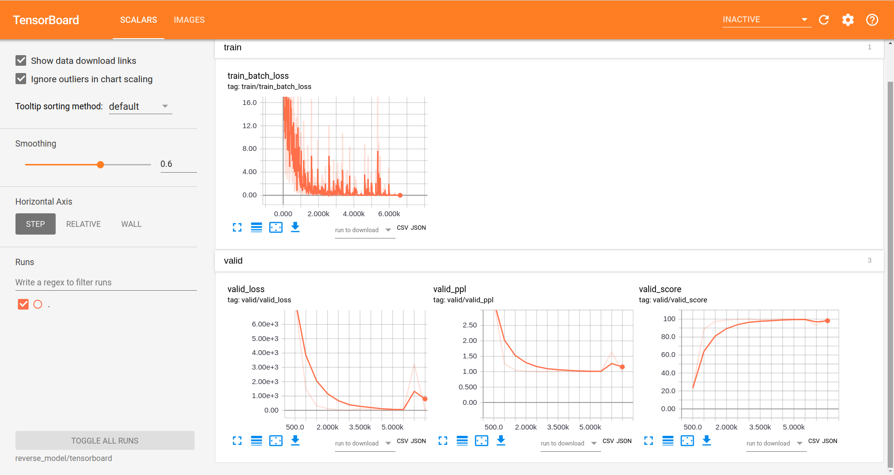
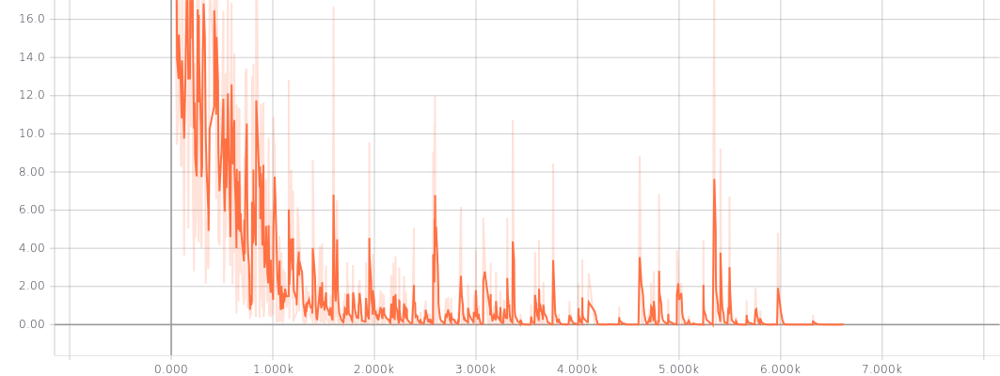
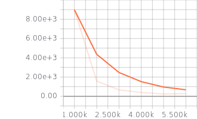
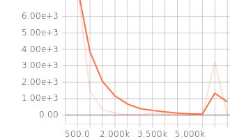
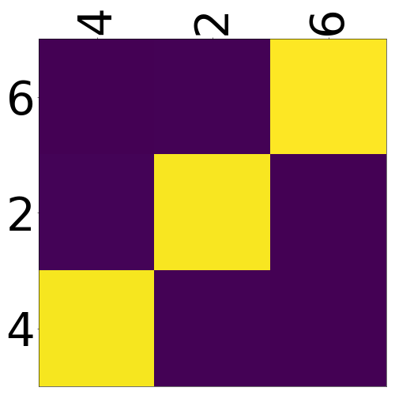
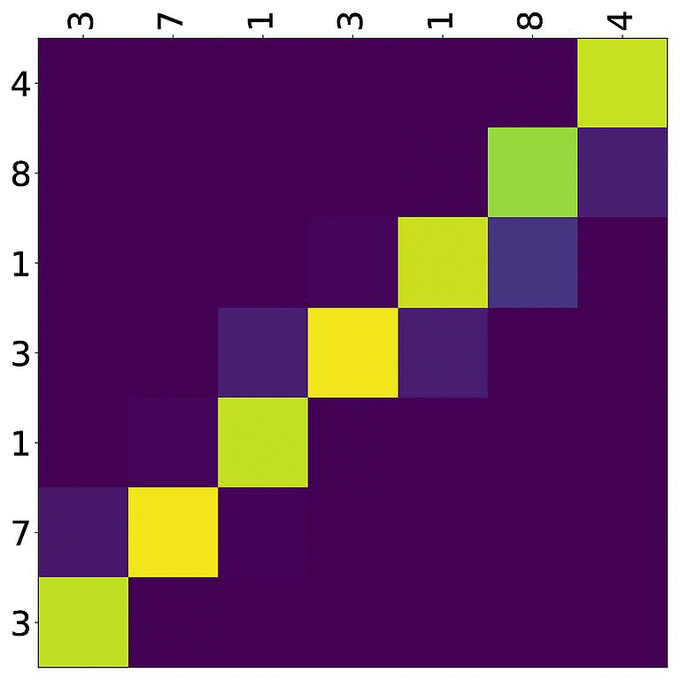
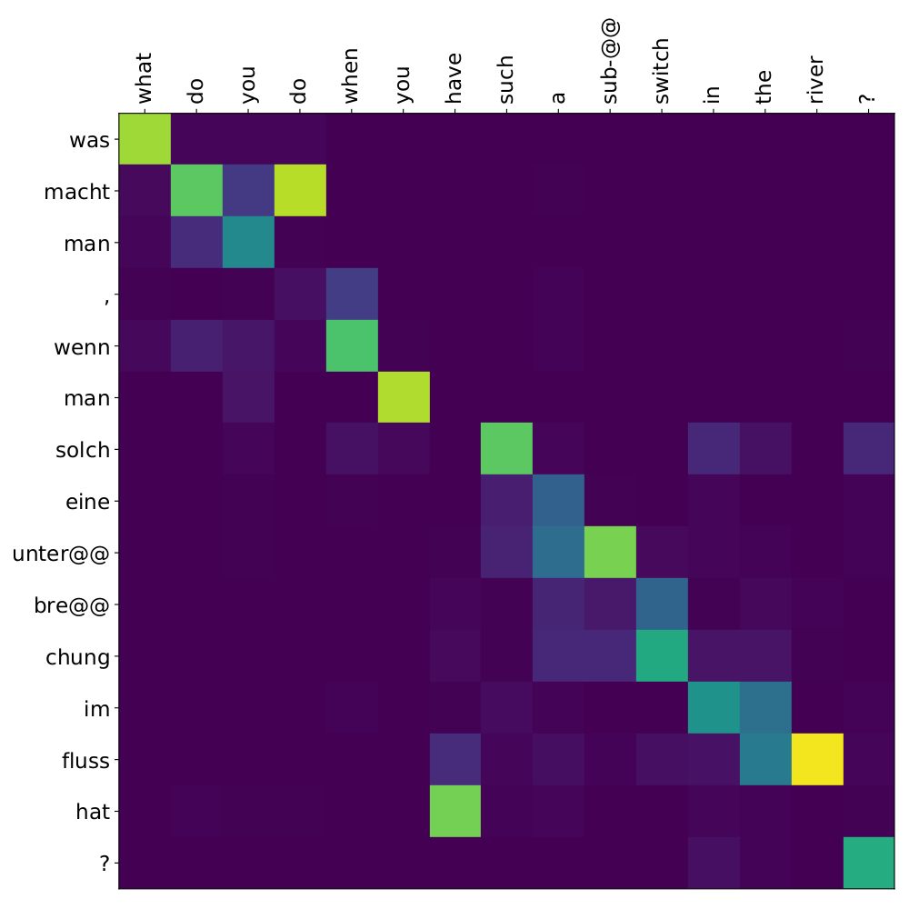
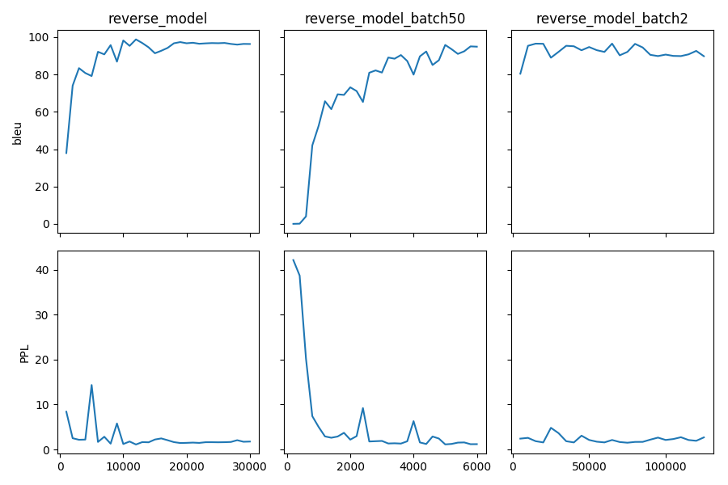

.. _tutorial:

========
Tutorial
========

In this tutorial you learn to build a recurrent neural translation system for a toy translation task, how to train, tune and test it.

Instead of following the example here, you might also run the `Colab Notebook <https://github.com/masakhane-io/masakhane/blob/master/starter_notebook.ipynb>`_ from the Masakhane project or the scripts compiled in `Joey Toy Models <https://github.com/bricksdont/joeynmt-toy-models>`_, that both walk you through the installation, data preparation, training, evaluation.

1. Data Preparation
===================
For training a translation model, you need parallel data, i.e. a collection of source sentences and reference translations that are aligned sentence-by-sentence and stored in two files,
such that each line in the reference file is the translation of the same line in the source file.

Synthetic Data
--------------

For the sake of this tutorial, we'll simply generate synthetic data to mimic a real-world translation task.
Our machine translation task is here to learn to reverse a given input sequence of integers.

For example, the input would be a source sentence like this:

::

    14 46 43 2 36 6 20 8 38 17 3 24 13 49 8 25

And the correct "translation" would be:

::

    25 8 49 13 24 3 17 38 8 20 6 36 2 43 46 14

Why is this an interesting toy task?

Let's generate some data!

.. code-block:: bash

    python3 scripts/generate_reverse_task.py

This generates 50k training and 1k dev and test examples for integers between 0 and 50 of maximum length 25 for training and 30 for development and testing.
Lets move it to a better directory.

.. code-block:: bash

    mkdir test/data/reverse
    mv train* test/data/reverse/
    mv test* test/data/reverse/
    mv dev* test/data/reverse/

Pre-processing
--------------

Before training a model on it, parallel data is most commonly filtered by length ratio, tokenized and true- or lowercased.
For our reverse task, this is not important, but for real translation data it matters.

The Moses toolkit provides a set of useful `scripts <https://github.com/moses-smt/mosesdecoder/tree/master/scripts>`_ for this purpose.
For a standard pipeline, follow for example the one described in the `Sockeye paper <https://arxiv.org/pdf/1712.05690.pdf>`_.

In addition, you might want to build the NMT model not on the basis of words, but rather sub-words or characters (the ``level`` in JoeyNMT configurations).
Currently, JoeyNMT supports word-based, character-based models and sub-word models with byte-pair-encodings (BPE) as learned with `subword-nmt <https://github.com/rsennrich/subword-nmt>`_.

2. Configuration
================

Once you have the data, it's time to build the NMT model.

In JoeyNMT, experiments are specified in configuration files, in `YAML <http://yaml.org/>`_ format.
Most importantly, the configuration contains the description of the model architecture (e.g. number of hidden units in the encoder RNN),
paths to the training, development and test data, and the training hyperparameters (learning rate, validation frequency etc.).

You can find examples in the `configs directory <https://github.com/joeynmt/joeynmt/tree/master/configs>`_.
`small.yaml <https://github.com/joeynmt/joeynmt/tree/master/configs/small.yaml>`_ contains a detailed explanation of all configuration options.

For the tutorial we'll use `reverse.yaml <https://github.com/joeynmt/joeynmt/tree/master/configs/reverse.yaml>`_. We'll go through it section by section.

1. Data Section
---------------

Here we give the path to the data (".src" is the source suffix, ".trg" is the target suffix)
and indicate which segmentation level we want to train on, here simply on the word level, as opposed to the character level.
The training set will be filtered by ``max_sent_length``, i.e. only examples where source and target contain not more than 25 tokens are retained for training (that's the full data set for us).
Source and target vocabulary are created from the training data, by keeping ``src_voc_limit`` source tokens that occur at least ``src_voc_min_freq`` times, and equivalently for the target side.
If you want to use a pre-generated vocabulary, you can load it with ``src_vocab`` and ``trg_vocab``. This will be important when loading a trained model for testing.

.. code-block:: python

    data:
        src: "src"
        trg: "trg"
        train: "test/data/reverse/train"
        dev: "test/data/reverse/dev"
        test: "test/data/reverse/test"
        level: "word"
        lowercase: False
        max_sent_length: 25
        src_voc_min_freq: 0
        src_voc_limit: 100
        trg_voc_min_freq: 0
        trg_voc_limit: 100
        #src_vocab: "reverse_model/src_vocab.txt"
        #trg_vocab: "reverse_model/trg_vocab.txt"

2. Training Section
-------------------

This section describes how the model is trained.
Training stops when either the learning rate decreased to ``learning_rate_min`` (when using a decreasing learning rate schedule) or the maximum number of epochs is reached.
For individual schedulers and optimizers, we refer to the `PyTorch documentation <https://pytorch.org/docs/stable/index.html>`_.

Here we're using the "plateau" scheduler that reduces the initial learning rate by ``decrease_factor`` whenever the ``early_stopping_metric`` has not improved for ``patience`` validations.
Validations (with greedy decoding) are performed every ``validation_freq`` batches and every ``logging_freq`` batches the training batch loss will be logged.

Checkpoints for the model parameters are saved whenever a new high score in ``early_stopping_metric``, here the ``eval_metric`` BLEU, has been reached.
In order to not waste much memory on old checkpoints, we're only keeping the ``keep_last_ckpts`` last checkpoints.

At the beginning of each epoch the training data is shuffled if we set ``shuffle`` to True (there is actually no good reason for not doing so).

With `use_cuda` we can decide whether to train the model on GPU (True) or CPU (False). Note that for training on GPU you need the appropriate CUDA libraries installed.

*Caution*: In this example we set ``overwrite: True`` which you shouldn't do if you're running serious experiments, since it overwrites the existing ``model_dir`` and all its content if it already exists and you re-start training.

.. code-block:: python

    training:
        random_seed: 42
        optimizer: "adam"
        learning_rate: 0.001
        learning_rate_min: 0.0002
        weight_decay: 0.0
        clip_grad_norm: 1.0
        batch_size: 10
        scheduling: "plateau"
        patience: 5
        decrease_factor: 0.5
        early_stopping_metric: "eval_metric"
        epochs: 6
        validation_freq: 1000
        logging_freq: 100
        eval_metric: "bleu"
        model_dir: "reverse_model"
        overwrite: True
        shuffle: True
        use_cuda: False
        max_output_length: 30
        print_valid_sents: [0, 3, 6]
        keep_last_ckpts: 2

3. Testing Section
------------------

Here we only specify which decoding strategy we want to use during testing. If ``beam_size: 1`` the model greedily decodes, otherwise it uses a beam of ``beam_size`` to search for the best output.
`alpha` is the length penalty for beam search (proposed in `Wu et al. 2018 <https://arxiv.org/pdf/1609.08144.pdf>`_).

.. code-block:: python

    testing:
        beam_size: 10
        alpha: 1.0

4. Model Section
----------------

Here we describe the model architecture and the initialization of parameters.

In this example we use a one-layer bidirectional LSTM encoder with 64 units, a one-layer LSTM decoder with also 64 units.
Source and target embeddings both have the size of 16.

We're not going into details for the initialization, just know that it matters for tuning but that out default configurations should generally work fine.
A detailed description for the initialization options is described in `initialization.py <https://github.com/joeynmt/joeynmt/blob/master/joeynmt/initialization.py#L60>`_.

Dropout is applied onto the input of the encoder RNN with dropout probability of 0.1, as well as to the input of the decoder RNN and to the input of the attention vector layer (``hidden_dropout``).
Input feeding (`Luong et al. 2015 <https://aclweb.org/anthology/D15-1166>`_) means the attention vector is concatenated to the hidden state before feeding it to the RNN in the next step.

The first decoder state is simply initialized with zeros. For real translation tasks, the options are `last` (taking the last encoder state) or `bridge` (learning a projection of the last encoder state).

Encoder and decoder are connected through global attention, here through `luong` attention, aka the "general" (Luong et al. 2015) or bilinear attention mechanism.

.. code-block:: python

    model:
        initializer: "xavier"
        embed_initializer: "normal"
        embed_init_weight: 0.1
        bias_initializer: "zeros"
        init_rnn_orthogonal: False
        lstm_forget_gate: 0.
        encoder:
            rnn_type: "lstm"
            embeddings:
                embedding_dim: 16
                scale: False
            hidden_size: 64
            bidirectional: True
            dropout: 0.1
            num_layers: 1
        decoder:
            rnn_type: "lstm"
            embeddings:
                embedding_dim: 16
                scale: False
            hidden_size: 64
            dropout: 0.1
            hidden_dropout: 0.1
            num_layers: 1
            input_feeding: True
            init_hidden: "zero"
            attention: "luong"

That's it! We've specified all that we need to train a translation model for the reverse task.

3. Training
===========

Start
-----
For training, run the following command:

.. code-block:: bash

    python3 -m joeynmt train configs/reverse.yaml

This will train a model on the reverse data specified in the config,
validate on validation data,
and store model parameters, vocabularies, validation outputs and a small number of attention plots in the ``reverse_model`` directory.

Progress Tracking
-----------------

The Log File
^^^^^^^^^^^^

During training the JoeyNMT will print the training log to stdout, and also save it to a log file ``reverse_model/train.log``.
It reports information about the model, like the total number of parameters, the vocabulary size, the data sizes.
You can doublecheck that what you specified in the configuration above is actually matching the model that is now training.

After the reports on the model should see something like this:

::

    2019-04-10 23:14:59,056 Epoch 1 Step: 800 Batch Loss: 58.698814 Tokens per Sec: 11418.961022
    2019-04-10 23:15:08,522 Epoch 1 Step: 1000 Batch Loss: 71.565094 Tokens per Sec: 14743.648984
    2019-04-10 23:15:17,651 Hooray! New best validation result [eval_metric]!
    2019-04-10 23:15:17,655 Example #0
    2019-04-10 23:15:17,655         Raw source: ['33', '9', '15', '3', '14', '33', '32', '42', '23', '12', '14', '17', '4', '35', '0', '48', '46', '36', '46', '27', '2', '34', '35', '17', '36', '39', '7', '14', '9', '0']
    2019-04-10 23:15:17,655         Source: 33 9 15 3 14 33 32 42 23 12 14 17 4 35 0 48 46 36 46 27 2 34 35 17 36 39 7 14 9 0
    2019-04-10 23:15:17,655         Reference: 0 9 14 7 39 36 17 35 34 2 27 46 36 46 48 0 35 4 17 14 12 23 42 32 33 14 3 15 9 33
    2019-04-10 23:15:17,655         Raw hypothesis: ['0', '9', '14', '7', '39', '36', '17', '40', '35', '2', '26', '47', '22', '12', '46', '46', '42', '42', '42', '24', '24', '24', '24', '24', '24', '24', '24', '24', '24', '24']
    2019-04-10 23:15:17,655         Hypothesis: 0 9 14 7 39 36 17 40 35 2 26 47 22 12 46 46 42 42 42 24 24 24 24 24 24 24 24 24 24 24
    ...
    2019-04-10 23:15:17,656 Validation result at epoch 1, step 1000: bleu: 37.957326, loss: 34737.589844, ppl: 8.401401, duration: 9.1334s

The training batch loss is logged every 200 mini-batches, as specified in the configuration, and every 1000 batches the model is validated on the dev set.
So after 1000 batches the model achieves a BLEU score of 37.96 (which will not be that fast for a real translation task, our reverse task is much easier).
You can see that the model prediction is only partially correct, up to the 7th token.

The loss on individual batches might vary and not only decrease, but after every completed epoch, the accumulated training loss for the whole training set is reported.
This quantity should decrease if your model is properly learning.

Validation Reports
^^^^^^^^^^^^^^^^^^

The scores on the validation set express how well your model is generalizing to unseen data.
The ``validations.txt`` file in the model directory reports the validation results (Loss, evaluation metric (here: BLEU), Perplexity (PPL)) and the current learning rate at every validation point.

For our example, the first lines should look like this:

::

    Steps: 1000     Loss: 34737.58984       PPL: 8.40140    bleu: 37.95733  LR: 0.00100000  *
    Steps: 2000     Loss: 14954.59082       PPL: 2.49997    bleu: 74.06024  LR: 0.00100000  *
    Steps: 3000     Loss: 12533.76465       PPL: 2.15535    bleu: 83.41361  LR: 0.00100000  *
    Steps: 4000     Loss: 12846.20703       PPL: 2.19701    bleu: 80.79483  LR: 0.00100000

Models are saved whenever a new best validation score is reached, in ``batch_no.ckpt``, where ``batch_no`` is the number of batches the model has been trained on so far.
You can see when a checkpoint was saved by the asterisk at the end of the line in ``validations.txt``.
``best.ckpt`` links to the checkpoint that has so far achieved the best validation score.

Learning Curves
^^^^^^^^^^^^^^^

JoeyNMT provides a `script <https://github.com/joeynmt/joeynmt/blob/master/scripts/plot_validations.py>`_ to plot validation scores with matplotlib.
You can choose several models and metrics to plot. For now, we're interested in BLEU and perplexity and we want to save it as png.

.. code-block:: bash

    python3 scripts/plot_validations.py reverse_model --plot_values bleu PPL  --output_path reverse_model/bleu-ppl.png

It should look like this:

Tensorboard
^^^^^^^^^^^

JoeyNMT additionally uses `TensorboardX <https://github.com/lanpa/tensorboardX>`_ to visualize training and validation curves and attention matrices during training.
Launch `Tensorboard <https://github.com/tensorflow/tensorboard>`_ (requires installation that is not included in JoeyNMTs requirements) like this:

.. code-block:: bash

    tensorboard --logdir reverse_model/tensorboard

and then open the url (default: ``localhost:6006``) with a browser.

You should see something like that:

We can now inspect the training loss curves, both for individual batches

and for the whole training set:

and the validation loss:

Looks good! Training and validation loss are decreasing, that means the model is doing well.

Attention Visualization
-----------------------

Attention scores often allow us a more visual inspection of what the model has learned.
For every pair of source and target token the model computes attention scores, so we can visualize this matrix.
JoeyNMT automatically saves plots of attention scores for examples of the validation set (the ones you picked for ``print_valid_examples``) and saves them in your model directory.

Here's an example, target tokens as columns and source tokens as rows:

The bright colors mean that these positions got high attention, the dark colors mean there was not much attention.
We can see here that the model has figured out to give "2" on the source high attention when it has to generate "2" on the target side.

Tensorboard (tab: "images") allows us to inspect how attention develops over time, here's what happened for a relatively short sentence:

For real machine translation tasks, the attention looks less monotonic, for example for an IWSLT de-en model like this:

4. Testing
==========

There are *three* options for testing what the model has learned.

In general, testing works by loading a trained model (``load_model`` in the configuration) and feeding it new sources that it will generate predictions for.

1. Test Set Evaluation
----------------------

For testing and evaluating on the parallel test set specified in the configuration, run

.. code-block:: bash

    python3 -m joeynmt test reverse_model/config.yaml --output_path reverse_model/predictions

This will generate beam search translations for dev and test set (as specified in the configuration) in ``reverse_model/predictions.[dev|test]``
with the latest/best model in the ``reverse_model` directory (or a specific checkpoint set with ``load_model``).
It will also evaluate the outputs with ``eval_metric`` and print the evaluation result.
If ``--output_path`` is not specified, it will not store the translation, and solely do the evaluation and print the results.

The evaluation for our reverse model should look like this:

::

    test bleu: 98.48812178559285 [Beam search decoding with beam size = 10 and alpha = 1.0]
    Translations saved to: reverse_model/test_predictions.test
    dev  bleu: 98.80524689263555 [Beam search decoding with beam size = 10 and alpha = 1.0]
    Translations saved to: reverse_model/test_predictions.dev

Once again you can see that the reverse task is relatively easy to learn, while for translation high BLEU scores like this would be miraculous/suspicious.

2. File Translation
-------------------

In order to translate the contents of any file (one source sentence per line) not contained in the configuration (here ``my_input.txt``), simply run

.. code-block:: bash

    echo $'2 34 43 21 2 \n3 4 5 6 7 8 9 10 11 12' > my_input.txt
    python3 -m joeynmt translate reverse_model/config.yaml < my_input.txt

The translations will be written to stdout or alternatively ``--output_path`` if specified.

For this example the output (all correct!) will be

::

        2 21 43 34 2
        12 11 10 9 8 7 6 5 4 3

3. Interactive
--------------
If you just want try a few examples, run

.. code-block:: bash

    python3 -m joeynmt translate reverse_model/config.yaml

and you'll be prompted to type input sentences that JoeyNMT will then translate with the model specified in the configuration.

Let's try a challenging long one:

::

    Please enter a source sentence (pre-processed):
    1 23 23 43 34 2 2 2 2 2 4 5 32 47 47 47 21 20 0 10 10 10 10 10 8 7 33 36 37
    JoeyNMT: 37 36 33 7 8 10 10 10 10 10 0 20 21 47 47 47 32 5 4 2 2 2 2 2 34 43 23 10 1

5. Tuning
=========
Trying out different combinations of hyperparameters to improve the model is called "tuning".
Improving the model could mean in terms of generalization performance at the end of training, faster convergence or making it more efficient or smaller while achieving the same quality.
For our case that means going back to the configuration and changing a few of the hyperparameters.

For example, let's try out what happens if we increase the batch size to 50 or reduce it to 2 (and change the "model_dir"!).
For a one-to-one comparison we consequently need to divide or multiply the validation frequency by 5, respectively, since the "steps" are counted in terms of mini-batches.
In the plot below we can see that we reach approximately the same quality after 6 epochs, but that the shape of the curves looks quite different.
In this case, a small mini-batch size leads to the fastest progress but also takes noticeabl longer to complete the full 6 epochs in terms of wall-clock time.

You might have noticed that there are lots hyperparameters and that you can't possible try out all combinations to find the best model.
What is commonly done instead of an exhaustive search is grid search over a small subset of hyperparameters,
or random search (`Bergstra & Bengio 2012 <http://www.jmlr.org/papers/volume13/bergstra12a/bergstra12a.pdf>`_), which is usually the more efficient solution.

6. What's next?
===============
If you want to implement something new in JoeyNMT or dive a bit deeper, you should take a look at the architecture :ref:`overview` and explore the API documentation of :ref:`modules`.

Other than that, we hope that you found this tutorial helpful. Please leave an `issue on Github <https://github.com/joeynmt/joeynmt/issues>`_ if you had trouble with anything or have ideas for improvement.
